# Open Design and Technology  
## Final Project README

> **Project Weight:** 70%  
> **Team Size:** 2 students  
> **Project Duration:** 4 weeks  
> **Class Time Available:** 6 hours per class  
> **Total Time Available:** 48 effort-hours per team  
> **Project Type:** Playful, interactive, technology-based experience

---

# Before you begin

## Fork and rename this repository
After forking this repository, rename it using the format:

`ODT-2026-TeamName`

### Example
`ODT-2026-PixelWizards`

Do not keep the default repository name.

---

# How to use this README

This file is your team’s **working project document**.

You must keep updating it throughout the 4-week build period.  
By the final review, this README should clearly show:
- your idea,
- your planning,
- your design decisions,
- your technical process,
- your build progress,
- your testing,
- your failures and changes,
- your final outcome.

## Rules
- Fill every section.
- Do not delete headings.
- If something does not apply, write `Not applicable` and explain why.
- Add images, screenshots, sketches, links, and videos wherever useful.
- Update task status and weekly logs regularly.
- Use this file as evidence of process, not only as a final report.

---

# 1. Team Identity

## 1.1 Studio / Group Name
`Radiance`

## 1.2 Team Members

| Name | Primary Role | Secondary Role | Strengths Brought to the Project |
|---|---|---|---|
| `Anish Baxi` | `Coding, App ` | `Photography` | `Strong understanding of code logic, syntax and debugging, photography skills` |
| `Tejas Kulkarni` | `Electronics, Assembly` | `Fabrication, Documentation` | `Strong skills in CAD software and laser cutting, 3D printing. Comprehensive documentation and organization skills` |

## 1.3 Project Title
`Light Printer`

## 1.4 One-Line Pitch
`A moving neopixel strip displaying an image pattern, captured through exposure photography`

## 1.5 Expanded Project Idea
In 1–2 paragraphs, explain:
- what your project is,
- what kind of playful experience it creates,
- what makes it fun, curious, engaging, strange, satisfying, competitive, or delightful,
- what technologies are involved.

**Response:**  
`A user draws a simple colour image on the MITapp. The line data for each column is converted into a grid for a neopixel strip. The strip is mounted on a mechanism which uses the SC8UU ball bearings, metal and threaded rods and a stepper motor to provide linear motion. The camera captures the image of the neopixel in real time through exposure photography. It provides the experience of a user seeing an image come to life in a medium they have never seen before. It hinges on anticipation and confusion of the seemingly random pattern the NeoPixel displays one after another to invest the user, and deliver a satisying payoff when they see the complete image.`

---

# 2. Philosophy Fit

## 2.1 Experience, Not Social Problem
This module does **not** require your project to solve a large social problem.

You are allowed to build:
- toys,
- games,
- interactive objects,
- playful machines,
- kinetic artifacts,
- humorous devices,
- strange but delightful experiences,
- things that are entertaining to use or watch.

## 2.2 What kind of experience are you creating?
Answer the following:
- What is the experience?
- What do you want the player or participant to feel?
- Why would someone want to try it again?

**Response:**  
`The project not only invites interaction, but allows active participation of the user through drawing by engaging imagination. The central experience is the visualization of the users drawing in a unique medium. The anticipation creates buildup and excitement as the data is converted. As the NP starts moving the user is confused by the flashing pattern of the NeoPixel. Once they see the final image formed on the camera, confusion turns into satisfaction. Now that they know ho the printer works, they will be excited to try out new drawings. `

## 2.3 Design Persona
Complete the sentence below:

> We are designing this project as if we are a small creative studio making a **[toy / game / playable object / interactive experience]** for **[children / teens / adults / classmates / exhibition visitors / mixed audience]**.

**Response:**  
`We are designing this project as if we are a small creative studio making an interactive experience for a mixed audience`

---

# 3. Inspiration

## 3.1 References
List what inspired the project.

| Source Type | Title / Link | What Inspired You |
|---|---|---|
| `Object` | `Living Mirror - https://www.youtube.com/watch?v=aJeB7yPpRAY` | `The unique method of using light as a medium through electronics.` |
| `Website` | `Eric Staller - https://lightpaintingphotography.com/eric-staller/` | `The scope of exposure lighting and light painting` |

## 3.2 Original Twist
What makes your project original?

**Response:**  
`The idea of light painting has always been reserved for the people with a expert knowledge of photography and creative visualization. Through this project, we want to democratise light painting by aligning it with the basic ability to draw with your fingers, making it accessible to everyone.`

---

# 4. Project Intent

## 4.1 Core Interaction Loop
Describe the main loop of interaction.

Examples:
- press → launch → score → reset
- connect → control → observe → repeat
- turn → trigger → react → repeat
- move object → sensor detects → sound/light response → player reacts

**Response:**  
`imagine → draw → anticipate → neopixel moves → bewilderment → camera captures movement → reacts → repeat`

## 4.2 Intended Player / Audience

| Question | Response |
|---|---|
| Who is this for? | `mixed audiences` |
| Age range | `12-70` |
| Solo or multiplayer | `solo` |
| Expected duration of one round | `45-50 seconds` |
| What should the player feel? | `imagination, anticipation, confusion, amazement ` |
| Is explanation required before use? | `Yes. Basic instructions regarding what sort of drawing might be best suited and how exposure photography works` |

## 4.3 Player Journey
Describe exactly how a player will use the project.

1. **Approach:** `The player steps into a dark/dimly lit room`
2. **Start:** `The player is intrigued by the setup of the LEDs, camera and drawing screen.`
3. **First Action:** `The player begins by looking at an empty canvas and imagining what can be drawn.`
4. **Main Interaction:** `Player draws simple pixel art using different colours`
5. **System Response:** `The systems task is to convert the drawing taken into accurae neopixel data, and execute neopixel and motor precisely, to form an accurate and recognizable drawing.`
6. **Win / Lose / End Condition:** `When the camera captures the exposure photo, and it is seen by the user.`
7. **Reset:** `Motor moves to reset NP to original position, camera resets to photography mode. A new or same userbegins another drawing on the screen. `

## 4.4 Rules of Play
If your project is a game, list the rules clearly.

- `NA (it is an interactive experience with drawing)`
---

# 5. Definition of Success

## 5.1 Definition of “Playable”
Your project will be considered complete only if these conditions are met.

- [x] `The camera captures a clear image through exposure photography.`
- [x] `The NP pattern displayed is a comprehensible representation of what the user expects to see.`

## 5.2 Minimum Viable Version
What is the smallest version of this project that still delivers the core experience?

**Response:**  
`The user selects from a collection of pre made patterns, which is then displayed by the NeoPixel. The core experience of anticipation, confusion and satisfaction still stays. Only the form of input from the user's side is altered.`

## 5.3 Stretch Features
What features are nice to have but not essential?

- `Custom casing to keep phone in`
- `RGB colour data instead of single colour`

---

# 6. System Overview

## 6.1 Project Type
Check all that apply.

- [x] Electronics-based
- [x] Mechanical
- [ ] Sensor-based
- [x] App-connected
- [x] Motorized
- [ ] Sound-based
- [x] Light-based
- [x] Screen/UI-based
- [x] Fabricated structure
- [ ] Game logic based
- [ ] Installation / tabletop experience
- [x] Other: `Photography based`

## 6.2 High-Level System Description
Explain how the system works in simple terms.

Include:
- input,
- processing,
- output,
- physical structure,
- app interaction if any.

**Response:**  
`The user draws an image on an HTML app where the screen is made up of a grid of buttons in the same proportion as the NP strip. Various control buttons allow them to erase, change colour, etc. the RGB value for each button is sent to the ESP 32 as an array. The ESP32 drives the NeoPixel strip, lighting each LED according to the column data, while simultaneously controlling a stepper motor that moves the strip laterally along a linear rail using metal rods, linear ball bearings and holders. A camera set to long-exposure mode captures the full sweep of the moving NeoPixel strip in a single frame, reconstructing the original drawing as a light painting. As the strip reaches the end, a limit switch is activated, which is programed to move the stepper in the opposite direction, resetting the NeoPixel plate to it's original position. `

## 6.3 Input / Output Map

| System Part | Type | What It Does |
|---|---|---|
| `App` | Input | `Allows user to draw pixel art, sends to ESP32` |
| `ESP32` | Processing | `Takes RGB array and turns into NeoPixel instructions, controls motor` |
| `Stepper Motor` | Output | `Drives rotational motion` |
| `NeoPixel strip` | Output | `Shows drawing pattern for each column` |
| `Limit Switch` | Input | `Controls when the stepper is to be stopped and reset` |
| `Linear Shaft Rail` | Physical Action | `Allows smooth, precise lateral motion` |

---

# 7. Sketches and Visual Planning

## 7.1 Concept Sketch
Add an early sketch of the full idea.

**Insert image below:**  
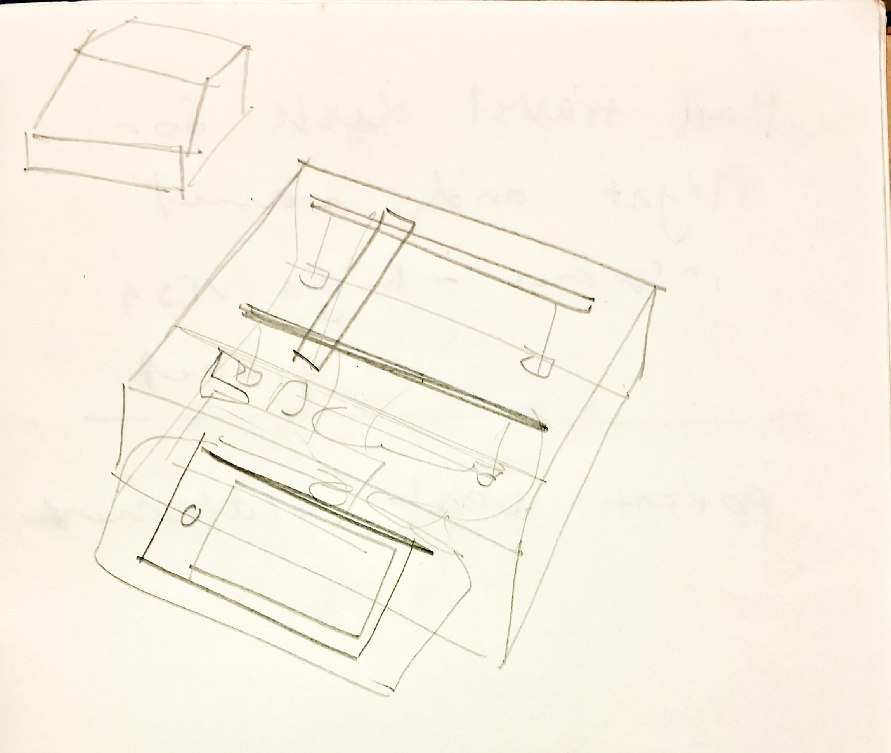 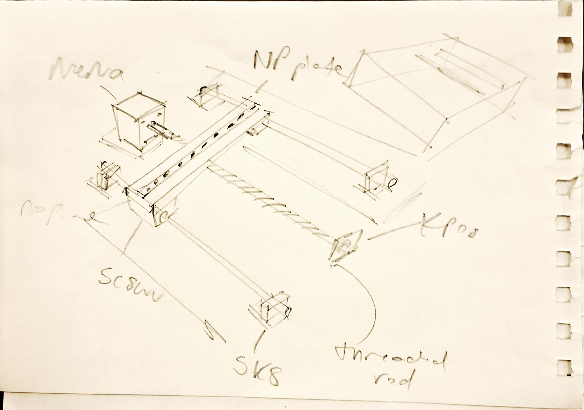

Example:
```md

```

## 7.2 Labeled Build Sketch
Add a sketch with labels showing:
- structure,
- electronics placement,
- user touch points,
- moving parts,
- output elements.

**Insert image below:**  
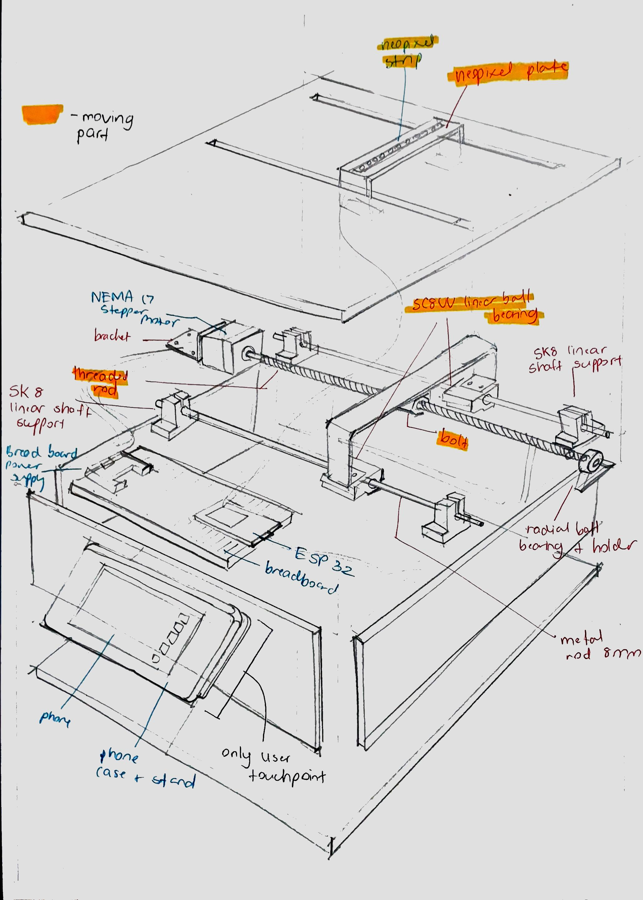 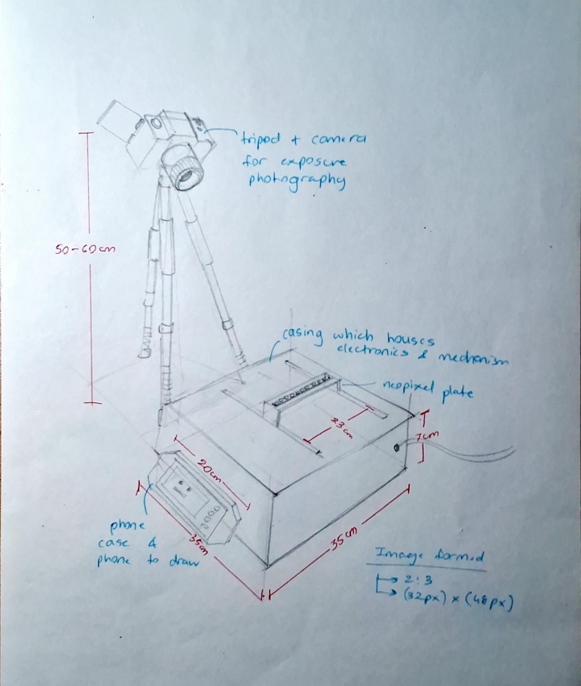

## 7.3 Approximate Dimensions

| Dimension | Value |
|---|---|
| Length | `500mm` |
| Width | `400mm` |
| Height | `130mm` |
| Estimated weight | `4 kg` |

---

# 8. Mechanical Planning

## 8.1 Mechanical Features
Check all that apply.

- [ ] Gears
- [ ] Pulleys
- [ ] Belt drives
- [ ] Linkages
- [ ] Hinges
- [x] Shafts
- [ ] Springs
- [x] Bearings
- [ ] Wheels
- [x] Sliders
- [ ] Levers
- [ ] Not applicable

## 8.2 Mechanical Description
Describe the mechanism and what it is meant to do.

**Response:**  
`The main mechanism is a linear rail shaft used to smoothly move a neopixel plate in 1 axis. It is made up of 2 metal rods of lengh 400 mm mounted on 2 SK8 linear rail shaft supports each. 2 SC8UU linear ball bearings are mounted on each shaft, which allow for frictionless movement. A MDF plate sits on top of the SC8UUs on which the NeoPixel strip is placed. The plate is attached to a threaded rod using a bolt. The threaded is connected to a NEMA stepper motor on one side, and a rotational ball bearing on the other. The ball bearing and the motor are held upright using laser cut brackets.`

## 8.3 Motion Planning
If something moves, explain:
- what moves,
- what causes the movement,
- how far it moves,
- how fast it moves,
- what could go wrong.

**Response:**  
`Movement is driven by a NEMA 17 stepper attached to thethreaded rod. The bolt attached to the plate converts rotational motion into translational displacement. As the bolt moves, the NP plate moves as well, guided by the linear shaft rail. It moves laterally till it reaches the end of the shaft. Travel speed is calculated to match the camera's shutter speed, too fast produces motion blur within each column, too slow makes the exposure too long and risks ambient light contamination. `

## 8.4 Simulation / CAD / Animation Before Making
If your project includes mechanical motion, document the digital planning before fabrication.

| Tool Used | File / Link | What Was Tested |
|---|---|---|
| `Blender` | https://github.com/user-attachments/assets/33fdeb04-4cba-499a-84b8-949dbbae3568 | `The exact placement of mechanical components. How exactly rotational motion of the stepper is converted into translational.` |

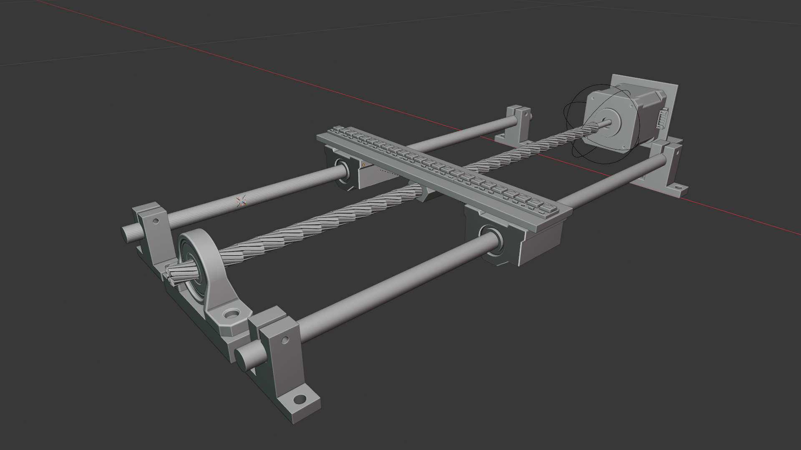 

## 8.5 Changes After Digital Testing
What changed after the CAD, animation, or simulation stage?

**Response:**  
`We realized we had no concrete plan on how to mount the threaded rod. After research, we found out we will need a bracket to attach the stepper to the base plate along with a radial ball bearing to freely rotate the threaded rod while keeping it stable.`

---

# 9. Electronics Planning

## 9.1 Electronics Used

| Component | Quantity | Purpose |
|---|---:|---|
| `ESP32` | `1` | `Main controller` |
| `Neo-Pixel strip (8 bit RGB)` | `3` | `Creating a column of 24 LEDs which will display image pattern` |
| `Nema17 Stepper Motor` | `1` | `Driving the main motion at a high RPM` |
| `LM2596` | `1` | `Step down buck converter to adjust voltage given to the stepper motor.` |
| `L298Ndual H-bridge` | `1` | `To drive stepper motor` |
| `Limit Switch` | `2` | `To stop the motor as soon as the NP plate reaches the end of the rod and reset it back to original position.` |

## 9.2 Wiring Plan
Describe the main electrical connections.

**Response:**  
`The NEMA 17 Stepper motor needs 12V voltage. It is powered using the H-bridge. The black, green, red and blue of the stepper are connected to OUT1, OUT2, OUT3, OUT4 of the H-bridge respectively. The 12V anf GND of H-bridge recieve power from power adapter. Then IN1-4 of the H-bridge go to the ESP GPIO pins to recieve input. A LM2596 Step down buck converter will be required to power the Neopixel strip. The 12V and ground from wall adapter got to VIN+ and VIN-. The LM2596 is tuned to output 5v from 12V. the VOUT+ and VOUT- go to the breadboard with common ground where ESP and Neopixel strip connects. Additionally, the limit switch ON and C go to ESP GPIO and common ground respectively. The Neopixel strip is made of 3 smaller 8bit strips with connections to and from each other. The DI, 4-7V and GND go to the GPIO pin, and breadboard going to LM2596 respectively. `

## 9.3 Circuit Diagram
Insert a hand-drawn or software-made circuit diagram.

**Insert image below:**  
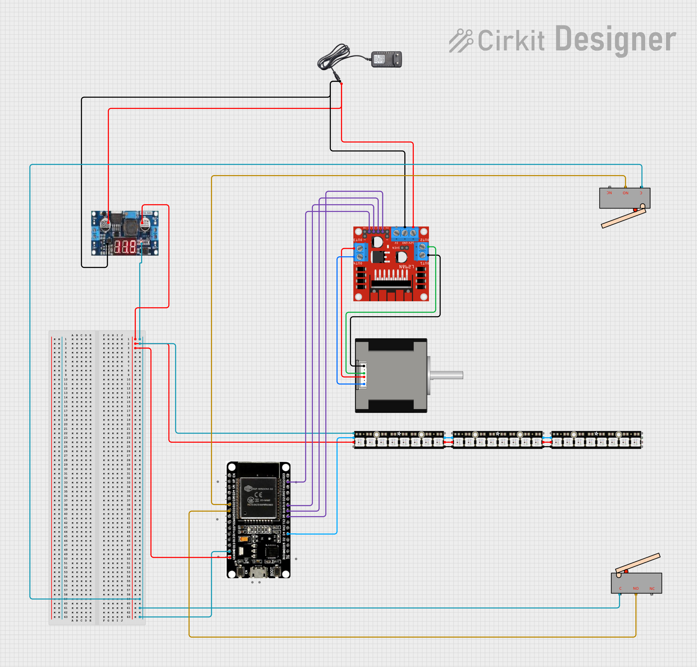 

## 9.4 Power Plan

| Question | Response |
|---|---|
| Power source | `Wall adapter` |
| Voltage required | `12V and 5V` |
| Current concerns | `Acciedntal 12V and GND cross connection in H-bridge or LM2596 can short circuit whole circuit` |
| Safety concerns | `H-bridge might overheat` |

---

# 10. Software Planning

## 10.1 Software Tools

| Tool / Platform | Purpose |
|---|---|
| `[MicroPython / Arduino / SPCK editor / CAD tool / other]` | `[Purpose]` |
| `[Tool]` | `[Purpose]` |

## 10.2 Software Logic
Describe what the code must do.

Include:
- startup behavior,
- input handling,
- sensor reading,
- decision logic,
- output behavior,
- communication logic,
- reset behavior.

**Response:**  
`On startup, the ESP32 initializes the LEDs, motor, switches, and creates a WiFi access point with a server. When the pixel data is received, it is distrubuted into RGB columns. The system then starts: the motor moves forward while LEDs display columns sequentially. The reverse switch stops forward motion, followed by a short pause, then the motor moves back without LEDs. The stop switch ends the cycle. Communication happens via HTTP between the phone and ESP32. After completion, the system resets by stopping the motor, clearing LEDs, and returning to the original state.`

## 10.3 Code Flowchart
Insert a flowchart showing your code logic.

Suggested sequence:
- start,
- initialize,
- wait for input,
- read input,
- decision,
- trigger output,
- repeat or reset,
- error handling.

**Insert image below:**  
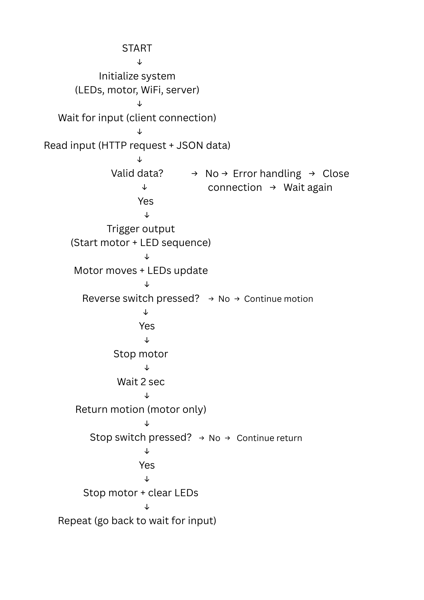

## 10.4 Pseudocode

```text
START

set up LEDs, motor, switches
turn on WiFi + server

LOOP forever:
    wait for phone to send data

    if data comes:
        read and convert into columns

        send OK back

        start LED sequence

        move forward + show LEDs
        while reverse switch not pressed:
            move motor forward
            update LED columns step by step

        stop motor
        wait 2 sec

        move back
        while stop switch not pressed:
            move motor backward

        stop motor
        turn off LEDs

END LOOP
```

---

# 11. SPCK Editor

## 11.1 Is an app part of this project?
- [x] Yes
- [ ] No

If yes, complete this section.

## 11.2 Why is the app needed?
Explain what the app adds to the experience.

Examples:
- remote control,
- score tracking,
- mode selection,
- personalization,
- triggering effects,
- displaying data.

**Response:**  
`The app is the main input took for the user. It is a canvas which allows the user to draw pixel art using their finger.`

## 11.3 App Features

| Feature | Purpose |
|---|---|
| `Send button` | `Connect phone to ESP32 network` |
| `Pixel canvas (24×24)` | `Draw the light pattern` |
| `Color picker` | `Select RGB values for pixels` |
| `Clear button` | `Reset the canvas` |

## 11.4 UI Mockup
Insert a sketch or screenshot of the app interface.

**Insert image below:**  
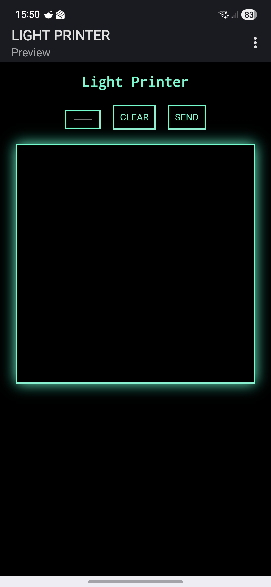  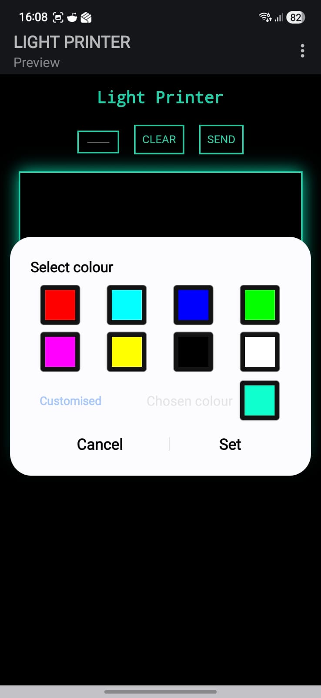

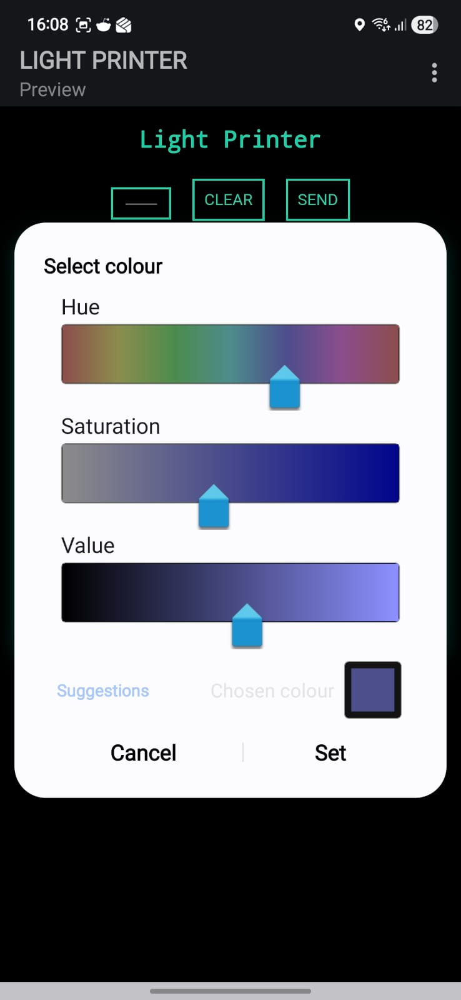  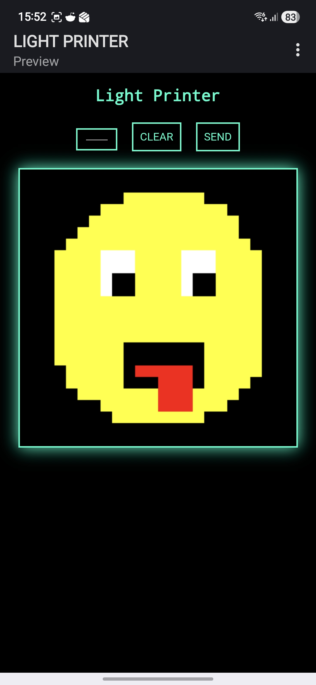

## 11.5 App Screen Flow

1. `Open app and draw on pixel canvas`
2. `Connect to ESP32 WiFi network`
3. `Press Send to transmit data`
4. `ESP32 runs motor + LED sequence`

---

# 12. Bill of Materials

## 12.1 Full BOM

| Item | Quantity | In Kit? | Need to Buy? | Estimated Cost | Material / Spec | Why This Choice? |
|---|---:|---|---|---:|---|---|
| `ESP32` | `1` | `Yes` | `No` | `0` | `NA` | `Microcontroller taught in class` |
| `NeoPixel Strip` | `3` | `No` | `No` | `NA` | `8 bit RGB` | `LED's are moe closely packed together` |
| `Metal rod` | `2` | `No` | `Yes` | `364` | `8mm diamter, 400mm length` | `Form axis along which NP plate will move` |
| `Linear Ball Bearing Slide` | `2` | `No` | `Yes` | `428` | `SC8UU` | `Allows for smooth linear motion along metal rod` |
| `Linear Ball Bearing support` | `4` | `No` | `Yes` | `452` | `SK8` | `To hold the rods stably` |
| `Nema17 Stepper Motor` | `1` | `No` | `Yes` | `711` | `JK42HS40-1204AF-02 NEMA17 4.2 kg-cm` | `It provides a higher RPM required to rapidly rotate threaded rod` |
| `Threaded rod` | `1` | `No` | `Yes` | `150-250` | `200mm length, 1mm pitch` | `Attached to stepper motor to attach brass nut on` |
| `Radial ball bearing` | `1` | `No` | `No` | `NA` | `625ZZ` | `To allow free rotation of threaded rod driven by sepper motor` |
| `Brass nut` | `1` | `No` | `Yes` | `20-70` | `Threaded brass nut` | `Component attached to NP plate to turn rotational motion into translational` |
| `Limit switch` | `2` | `Yes` | `No` | `NA` | `NA` | `When activated, acts as input to control stepper` |
| `MDF base plate` | `2` | `No` | `No` | `NA` | `laser cut` | `2 base plates, bigger one as base for entire build, smaller one mounted on SC8UUs which NeoPixel is kept on` |
| `Phone stand` | `1` | `No` | `No` | `NA` | `laser cut` | `To keep the phone upright as the user draws on it.` |
| `Stepper motor bracket` | `1` | `No` | `No` | `NA` | `laser cut` | `To hold the stepper in place at perpendicular angle.` |
| `Ball bearing holder` | `1` | `No` | `No` | `NA` | `laser cut` | `To stably hold radial ball bearing at perpendicular angle` |
| `Screws` | `20` | `No` | `Yes` | `100` | `4.5mm` | `Miscellaneuos + mounting Sk8s to base plate` |


## 12.2 Material Justification
Explain why you selected your main materials and components.

Examples:
- Why acrylic instead of cardboard?
- Why MDF instead of 3D print?
- Why servo instead of DC motor?
- Why bearing instead of a plain shaft hole?

**Response:**  
`1. Usng laser cut MDF as base plate, allows us to engrave precise placements of all components to eliminate human error.
 2. SC8UU + SK8 + 8mm rod over plain holes: Ball bearings eliminate friction and slop, ensuring smooth, consistent carriage travel.
 3. NEMA 17 stepper over DC/servo: 1024 steps allow precise control and smoothness. Provides higher RPM than stepper in kit
 4. Threaded rod + brass nut over belt drive: 1mm pitch leadscrew provides fine, slip-free linear resolution directly tied to step count.
 6. 8-bit RGB over NeoPixel strip: LEDs are more closely packed together, so they offer higher resolution`

## 12.3 Items to Purchase Separately

| Item | Why Needed | Purchase Link | Latest Safe Date to Procure | Status |
|---|---|---|---|---|
| `Metal rod` | `Form axis along which NP plate will move` | `Buying in Ulhasnagar` | `14th April` | `Received` |
| `Linear Ball Bearing Slide` | `Allows for smooth linear motion along metal rod` | `(https://robu.in/product/sc8uu-8-mm-linear-ball-bearing-slide-unit-cnc-3d-printer/)` | `10th April` | `Received` |
| `Linear Ball Bearing support` | `To hold the rods stably` | `https://robu.in/product/sk8-8mm-linear-bearing-rail-support-xyz-shaft-table-cnc-router-sh8a-2pcs/` | `10th April` | `Received` |
| `Nema17 Stepper Motor` | `Provides high RPM/torque required to rotate threaded rod` | `https://robu.in/product/nema17-40mm-1-2a-unipolar-stepper-motor-w-1m-cable/` | `10th April` | `Received` |
| `Threaded rod` | `Attached to stepper motor to move the brass nut` | `Buying in Ulhasnagar` | `14th April` | `Received` |
| `Brass nut` | `Turns rotational motion into translational for NP plate` | `Buying in Ulhasnagar` | `14th April` | `Received` |
| `Screws` | `Miscellaneuos + mounting Sk8s to base plate` | `Buying in Ulhasnagar` | `17th April` | `Received` |

## 12.4 Budget Summary

| Budget Item | Estimated Cost |
|---|---:|
| Electronics | `823` |
| Mechanical parts | `476` |
| Fabrication materials | `) (sourced from Makerspace)` |
| Purchased extras | `130` |
| Contingency | `NA` |
| **Total** | `1420` |

## 12.5 Budget Reflection
If your cost is too high, what can be simplified, removed, substituted, or shared?

**Response:**  
`Although this cost is high, it is naccesity for the precision e require. Additionally, all the parts, especially the NEMA motor, will be very useful when they will be reused after this project is over. A lot of the parts are also shared with ohers like radial ball bearing and MDF for build fabcrication. `

---

# 13. Planning the Work

## 13.1 Team Working Agreement
Write how your team will work together.

Include:
- how tasks are divided,
- how decisions are made,
- how progress will be checked,
- what happens if a task is delayed,
- how documentation will be maintained.

**Response:**  
`Tasks are divided by core strength: Anish does coding and photography (laptop script, image processing, camera setup), and Tejas does electronics and fabrication (wiring, motor assembly, CAD). Both contribute equally to testing and playtesting. Decisions are made jointly during class time. If a disagreement arises, we try out both approaches quickly and choose based on result. Progress is reviewed at the start of each class session with the weekly milestone checklist, and there are regular meetups assigned for planning and strategizing. If a task is delayed, the other member provides support and the milestone log is updated honestly. Documentation is maintained continuously by both the members. Tejas handles fabrication photos and CAD files, Anish handles code notes and testing logs.`

## 13.2 Task Breakdown

| Task ID | Task | Owner | Estimated Hours | Deadline | Dependency | Status |
|---|---|---|---:|---|---|---|
| T1 | `Finalize concept and system architecture` | `Both` | `2` | `Week 2` | `None` | `Done` |
| T2 | `Complete BOM and place component orders` | `Tejas` | `1` | `Week 3` | `T1` | `Done` |
| T3 | `Test NeoPixel strip with ESP32 (basic colour control)` | `Anish` | `2` | `Week 3` | `None` | `Done` |
| T4 | `Stepper motor code` | `Tejas` | `2` | `Week 3` | `T1, T2` | `Done` |
| T5 | `Test stepper motor + driver (basic movement)` | `Both` | `4` | `Week 3` | `T2, T4` | `Done` |
| T6 | `App code + column extraction code` | `Anish` | `4` | `Week 3` | `T1, T3` | `Done` |
| T7 | `CAD design + base plate` | `Tejas` | `3` | `Week 4` | `T2` | `Done` |
| T8 | `Assemble linear shaft` | `Both` | `5` | `Week 4` | `T2, T7` | `Done` |
| T9 | `Camera long-exposure setup and testing` | `Both` | `2` | `Week 4` | `T1-9` | `Done` |
| T10 | `Assemble outer casing` | `Anish` | `5` | `Week 4` | `T6-7` | `Done` |
| T12 | `Electrical addembly` | `Tejas` | `1` | `Week 4` | `T1-10` | `Done` |
| T13 | `Final documentation, photos` | `Tejas` | `5` | `Week 4` | `T1-12` | `To Do` |

## 13.3 Responsibility Split

| Area | Main Owner | Support Owner |
|---|---|---|
| Concept and gameplay | `Both` | `N/A` |
| Electronics | `Tejas` | `Anish` |
| Coding | `Anish` | `Tejas` |
| App | `Anish` | `Tejas` |
| Mechanical build | `Tejas` | `Anish` |
| Photography | `Anish` | `Tejas` |
| Testing | `Both` | `N/A` |
| Documentation | `Tejas` | `Anish` |

---

# 14. Weekly Milestones

## 14.1 Four-Week Plan

### Week 1 — Plan and De-risk
Expected outcomes:
- [x] Idea finalized
- [x] Core interaction decided
- [x] Sketches made
- [x] BOM completed
- [x] Purchase needs identified
- [x] Key uncertainty identified
- [x] Basic feasibility tested

### Week 2 — Build Subsystems
Expected outcomes:
- [x] Electronics tests completed
- [x] CAD / structure planning completed
- [x] App UI started if needed
- [x] Mechanical concept tested
- [x] Main subsystems partially working

### Week 3 — Integrate
Expected outcomes:
- [x] Physical body built
- [x] Electronics integrated
- [x] Code connected to hardware
- [x] App connected if required
- [x] First playable version exists

### Week 4 — Refine and Finish
Expected outcomes:
- [x] Technical bugs reduced
- [x] Playtesting completed
- [x] Improvements made
- [x] Documentation completed
- [x] Final build ready

## 14.2 Weekly Update Log

| Week | Planned Goal | What Actually Happened | What Changed | Next Steps |
|---|---|---|---|---|
| Week 1 | `Finalize concept` | `Concept was explored more but not finalized` | `Developments in the mechanism of the motor assembly, talks with faculty to optimise different pieces` | `complete BOM` |
| Week 2 | `Plan and assign tasks, start neopixel testing, order materials and components` | `Concept was reiterated, mechanicaal assembly ideation began, neopixel tested` | `Back and forth between drawing idea and photo booth idea after neopixel test, eventually finalizing drawing idea` | `place components order and go out to get materials` |
| Week 3 | `Create CAD model, test linear rail shaft, begin MIT App, plan electrnoics ` | `CAD model revealed our gaps in some mechanical assembly, linear rail test was successful but showed we still needed to buy miscellaneous parts (screws and nuts), app UI and backend code was completed` | `Due to MIT App inventor's limited capability, app was shifted to Gdevelop, a tool better suited for our project` | `Test Neopixel and rail shaft together, begin final assembly` |
| Week 4 | `Write the code for motor, test motor and it's capacity, complete final build using laser cut MDF and plywood, finalize electrical wiring and fix it to base, install secondary components like switches, test all components (motor, linear shaft and neopixel) together, playtest final build, complete documentation and repo` | `Final build was completed but took longer than expected due to laser cutting, we ran into unexpected problems while testing motor but resolved them eventually, after all secndary components were installed, wiring was finalized and taped down, once linear rail shaft was working individually, complete build was playtested with exposure photos` | `Most tasks were completed according to plan with only minor changes in assembly` | `Prepare for exhibition` |

---

# 15. Risks and Unknowns

## 15.1 Risk Register

| Risk | Type | Likelihood | Impact | Mitigation Plan | Owner |
|---|---|---|---|---|---|
| `Camera shutter speed and motor speed are not synchronized ` | `Technical` | `High` | `High` | `Calibrate motor steps-per-column against shutter speed` | `Anish` |
| `Ambient light contamination ruins long-exposure capture` | `Environment` | `Medium` | `High` | `Use a dark booth or fabric enclosure around the user and printer during the exposure.` | `Both` |
| `Laser cut MDF parts do not fit together correctly` | `Mechanical` | `Low` | `Medium` | `Build a test cut of one joint panel before committing to the full sheet` | `Tejas` |
| `Components delayed in shipping` | `Time` | `Low` | `High` | `identify local suppliers as backup for critical items ` | `Tejas` |
| `NEMA motor does not work` | `Technical` | `Medium` | `High` | `purchase NEMA motor driver (A4988) instead of using H-bridge` | `Tejas` |
| `Gedevelop code does not work / does not connect to ESP properly` | `Technical` | `Low` | `High` | `Debug, if that does not work, run app locally on Python on laptop instead of app` | `Anish` |

## 15.2 Biggest Unknown Right Now
What is the single biggest uncertainty in your project at this stage?

**Response:**  
`The precise synchronization between motor travel speed and camera shutter speed is the biggest unknown. The quality of the final light-print image depends entirely on each NeoPixel column being displayed for exactly the right duration as the carriage traverses one column-width of distance. If the timing is even slightly off, columns will overlap or leave gaps, making the output image unrecognizable.`

---

# 16. Testing and Playtesting

## 16.1 Technical Testing Plan

| What Needs Testing | How You Will Test It | Success Condition |
|---|---|---|
| `WiFi connection (ESP32 AP)` | `Connect phone to LED_Controller, send test request` | `Phone connects reliably, request received every time` |
| `App communication (HTTP)` | `Send multiple drawings (small + full grid)` | `No JSON errors, full data received consistently` |
| `LED output (NeoPixel)` | `Run manual test patterns` | `Correct colors, smooth column transitions` |
| `Mechanism movement (rail system)` | `Run full forward + reverse cycles` | `Smooth motion, no stalling or misalignment` |
| `Motor driver (H-bridge)` | `Continuous stepping under load` | `No overheating, stable steppingt` |
| `Limit switches` | `Manually trigger during motion` | `Immediate stop/reverse response` |
| `Sync (motor + LEDs)` | `Run during camera exposure` | `Columns align with motion, no drift` |

## 16.2 Playtesting Plan

| Question | How You Will Check |
|---|---|
| Do players understand what to do? | `Observe if they can draw and send without help` |
| Is the interaction satisfying? | `Watch reactions during light painting output` |
| Do players want another turn? | `See if they try multiple drawings` |
| Is the challenge balanced? | `Ask if drawing-to-output feels predictable` |
| Is the response clear and immediate? | `Check delay between send and system start` |

## 16.3 Testing and Debugging Log

| Date | Problem Found | Type | What You Tried | Result | Next Action |
|---|---|---|---|---|---|
| `18/04/2026` | `App sent data but esp32 showed JSON error` | `UI` | `Fixed request body formatting and ensured proper JSON structure` | `Worked` | `N/A` |
| `16/04/2026` | `NEMA 17 kept jittering and made incomplete cycles` | `Technical` | `Tried all the possible permutation and combination of pins until we found the right order` | `Motor started completing the steps and rotating seamlessly` | `Note down the colours of the wires attached to their respective GPIO pins` |
| `06/04/2026` | `Neopixel strip wasnt lighting up due to improper soldering` | `Mechanical` | `Re-soldered the strips with the help of the faculty` | `Worked` | `Tape down the neopixel on a double sided tape for macximum stability` |
| `20/04/2026` | `The neopixels werent turning off properly whilst moving, creating strips of light instead of pixels` | `Technical` | `Tried to change the code to make the NEMA 17 movement and the led flshing completely independene` | `Did not work` | `We let it be and focused on improving other aspects of the image` |

## 16.4 Playtesting Notes

| Tester | What They Did | What Confused Them | What They Enjoyed | What You Will Change |
|---|---|---|---|---|
| `[Peer / friend / classmate]` | `[Observation]` | `[Observation]` | `[Observation]` | `[Action]` |
| `[Peer / friend / classmate]` | `[Observation]` | `[Observation]` | `[Observation]` | `[Action]` |

---

# 17. Build Documentation

## 17.1 Fabrication Process
Describe how the project was physically made.

Include:
- cutting,
- 3D printing,
- assembly,
- fastening,
- wiring,
- finishing,
- revisions.

**Response:**  

`The entire build sits within a drawer sized box. The base plate is made of 5mm laser cut MDF with measured holes to mount the SK8s using screw, nut and washers. The top lid is laser cut as well, with 3 slits - 2 for the NeoPixel plate, 1 with acrylic sheet to give a peak into what the mechanism looks like. For maximum stability, the walls are cut from plywood and then nailed to the MDF, completing the box. There are 2 holes drilled into the plywood, to allow wiring to come through. Additionally, the base plate was mounted on 3 wooden blocks, to raise it's height such that the base plate does not exert all it's weight on the screws. `
`Once the SK8s were mounted, the rods were inserted along with the SC8UUs. Between both metal rods, a motor was fixed to an edge using wooden blocks glued to the MDF. This holds the motor in place. Previously, the plan was to purchase KP08 radial ball bearing with stand and a coupler to attach the threaded rod to motor's D-shaft and hold up the ball baring on the other end. But due to budget and time constraints, thoe were fabricated in the labs itself. The stand for the ball bearing was laser cut and glued, while the coupler was 3d printed and glued to the threaded rod. A nut was fit into a block of red wood, and then screwed into the threaded rod. The block procided good surface area to glue the nut to the SC8UU plate, such that when the nut moves, the SC8UU plate moves. Additionally, to hold the Neopixel plate above the slit on the lid, wooden blocks were glued to the SC8UU plate. The MDF Neopixel plate was taped on the wooden block, so that it moves along with SC8UUs.`
`Once the shaft was assembled, the electrical components and wiring were taped down using masking tape to secure them to the base plate. Additionally, to add some visual flair, the project title 'LIGHT PRINTER' was laser cut and glued to the top of the lid and sanded.`

## 17.2 Build Photos
Add photos throughout the project.

Suggested images:
- early sketch,
- prototype,
- electronics testing,
- mechanism test,
- app screenshot,
- final build.

Example:
```md


```

## 17.3 Version History

| Version | Date | What Changed | Why |
|---|---|---|---|
| `v1` | `18th February` | `original concept was ideated of using 2 axis motion to create wave path for LED using music` | `2 axis was unnecessary complexity, wave from music output wasn't interesting enouggh` |
| `v2` | `7th March` | `Idea pivoted to a pixel canvas` | `based on more user inout, output is more rewarding` |
| `v3` | `9th March` | `Idea shufts to phootbooth` | `uses complete RGB capabilities of NP` |
| `v4` | `10th March` | `Idea changed back to drawing canvas` | `pixel resolutio too less for photobooth` |
| `v5` | `10th March` | `App developed on Gdevelop instead of MIT app inventor` | `limited capability of MIT App` |
| `v6` | `13th March` | `Pixel resolution changes from 32x48 to 24x24` | `slow motor speed` |

---

# 18. Final Outcome

## 18.1 Final Description
Describe the final version of your project.

**Response:**  
`An interactive installation where the user can image and draw pixel art on an app, which is then transmitted to the ESP and subsequently a NeoPixel mounted on a linear rail shaft. As the Neopixel moves laterally, the pattern on the Neopixel changes, displaying the whole drawing one column at a time. This is captured by exposure photography, on which the whole pixel art can be seen in one image. `

## 18.2 What Works Well
- `The app is easy to use and intuitive.`
- `The image created by the NeoPixel and captured by the camera is clearly recognizable the art drawn by the user.`
- `The linear rail shaft works perfectly, creating the required movement.`

## 18.3 What Still Needs Improvement
- `Due to the pitch of the threaded rod, the motion is too slow, resulting in playing time being a lot longer than ideal.`
- `If the camera was automated and synced to the code instead of it being manual, it would not require human control.`

## 18.4 What Changed From the Original Plan
How did the project change from the initial idea?

**Response:**  
`The project has been thrpugh multiple iterations, including an audio wave visualizer, a photobooth and a drawing canvas. The deciding factor for these changes has been the type of user input best suited for the projetc. The drawing canvas was finally chosen since it engages the user through imagination.`

---

# 19. Reflection

## 19.1 Team Reflection
What did your team do well?  
What slowed you down?  
How well did you manage time, tasks, and responsibilities?

**Response:**  
`Our team especially great at time management, and finished the project well before the deadline. The only things which slightly slowed us down were the arrival of the components and some difficultis with getting the unfamiliar NEMA stepper to work.  We were also good at effeciently dividing tasks, taking up parallel responsibilities at once. We effeciently used the period before the parts were dleivered to meticuously plan the build. The tasks we took up complimented each other, and we made sure we could help each other out in our own tasks. `

## 19.2 Technical Reflection
What did you learn about:
- electronics,
- coding,
- mechanisms,
- fabrication,
- integration?

**Response:**  
`Since most of our electronic and mechanical were out of the kit, our major learning was understanding tp use components we haven't learnt in class through self learning. The lnear shaft mechanism requires precision, and so did the fabrication for it. We learnt to precisely pla measurement to mitigate errors. We began developing a sense of what fabrication technique to user wehre - relying on pre-manufactured parts where precision is key, while shifting to 3D and laser cut fabrication wjere flexibility is of the essence. Even the electronics were new to use. We figured out the complex wiring of the NEMA and how the wiring needed to be planned to account for two different voltages. For coding, we built upon the methods taught in class and added a layer of complexity. We wrote all the base code ourselves, and then used AI debug and integrate. Finally, we learnt how to finally compile all ou individual systems into a final build which comes together. `

## 19.3 Design Reflection
What did you learn about:
- designing for play,
- delight,
- clarity,
- physical interaction,
- player understanding,
- iteration?

**Response:**  
`We believe we followed the core brief of creating a non-functional project perfectly. The apporach was to imagine oursleves in place of the users, and assessing what experience provide the most entertaining sense of play. We started by mapping the journey of what the user is supposed to feel at each point, as we crafted a clear journey of imaination, anticipation and fascination. We learnt the importance of user input, to have them be invested with interacting with your project. Many of our decisions, like changing the resolution, or the speed were dictated by what the user would do and think.`

## 19.4 If You Had One More Week
What would you improve next?

**Response:**  
`Upgrade our components like the coupler and a threaded rod with higher pitch, to have the neopixel plate move faster, to create a faster experience. Additionally, a higher resolution by increasing neopixels add image reognizability. Currently, human control is required to operate the camera. Given more time, we would like to explore how we could automate that process as well.`

---

# 20. Final Submission Checklist

Before submission, confirm that:
- [x] Team details are complete
- [x] Project description is complete
- [x] Inspiration sources are included
- [x] Player journey is written
- [x] Sketches are added
- [x] BOM is complete
- [x] Purchase list is complete
- [x] Budget summary is complete
- [x] Mechanical planning is documented if applicable
- [x] App planning is documented if applicable
- [x] Code flowchart is added
- [x] Task breakdown is complete
- [x] Weekly logs are updated
- [x] Risk register is complete
- [x] Testing log is updated
- [x] Playtesting notes are included
- [x] Build photos are included
- [x] Final reflection is written

---

# 21. Suggested Repository Structure

```text
project-repo/
├── README.md
├── images/
│   ├── concept-sketch.jpg
│   ├── labeled-sketch.jpg
│   ├── circuit-diagram.jpg
│   ├── ui-mockup.jpg
│   ├── prototype-1.jpg
│   └── final-build.jpg
├── code/
│   ├── main.py
│   ├── test_code.py
│   └── notes.md
├── cad/
│   ├── models/
│   └── screenshots/
└── docs/
    ├── references.md
    └── extra-notes.md
```

---

# 22. Instructor Review

## 22.1 Proposal Approval
- [ ] Approved to proceed
- [ ] Approved with changes
- [ ] Rework required before proceeding

**Instructor comments:**  
`[Instructor fills this section]`

## 22.2 Midpoint Review
`[Instructor fills this section]`

## 22.3 Final Review Notes
`[Instructor fills this section]`
